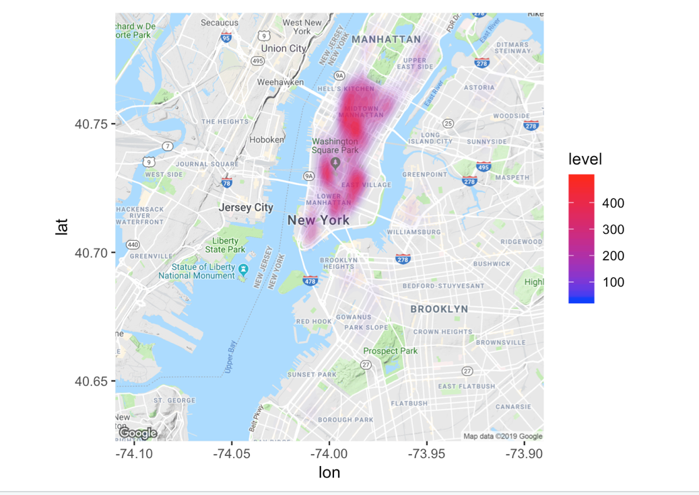

In the final project, we wanted to explore the relationship between customer review and sanitary rating. We obtained our data from two sources: web page and CSV by utilizing Yelp API for customer reviews and NYC Open Data for inspection scores and grades with location info. We were interested to find out if cleanliness and safety could potentially affect customers' reviews.

***

Reference: http://rpubs.com/jasano/inspex
Score instruction: https://www1.nyc.gov/assets/doh/downloads/pdf/rii/how-we-score-grade.pdf
blog: https://nycdatascience.com/blog/student-works/nyc-restaurants-reviews-and-inspection-scores/

***

# Acquiring resturant data from NYC Open Data using API
 
```{r}
library(RSocrata)
library(data.table)
library(httr)
library(keyring)
library(rjson)
library(RJSONIO)
library(jsonlite)
library(curl)
library(tidyverse)
library(yelpr)
library(stringr)
library(ggmap)
```

## Read in data

###Acquire Data using NYC open data API
```{r}
all_df<- read.socrata("https://data.cityofnewyork.us/resource/43nn-pn8j.json")
```

###It is always good to know what your data looks like. Using `Glimpse` function will give you a snapshot of your dataset. 
```{r}
glimpse(all_df)
```

### Tidy up data

#### Convert date information to date class
```{r}
all_df$grade_date <- as.Date(all_df$grade_date, "%Y-%m-%d")
all_df$inspection_date <- as.Date(all_df$inspection_date, "%Y-%m-%d")
all_df$record_date <- as.Date(all_df$record_date, "%Y-%m-%d %h:%m:%s")
```


## Yelp Fusion API 
#### Acquire Yelp business data.
There were 27050 rows of data and we could only retrieve 5000 at a time, thus we had 6 csv files to contain all the data. These 6 csv files were uploaded to Github.
For more detail, please go to this rpub:http://rpubs.com/weizhou2273/495496

#### Read csv files from github
```{r}
yelp1 <- read.csv("https://raw.githubusercontent.com/weizhou2273/data607_final/master/yelp_data/yelp1_5000.csv")
yelp2 <- read.csv("https://raw.githubusercontent.com/weizhou2273/data607_final/master/yelp_data/yelp5001_10000.csv")
yelp3 <- read.csv("https://raw.githubusercontent.com/weizhou2273/data607_final/master/yelp_data/yelp10001_15000.csv")
yelp4 <- read.csv("https://raw.githubusercontent.com/weizhou2273/data607_final/master/yelp_data/yelp15001_19946.csv")
yelp5 <- read.csv("https://raw.githubusercontent.com/weizhou2273/data607_final/master/yelp_data/yelp19947_24946.csv")
yelp6 <- read.csv("https://raw.githubusercontent.com/weizhou2273/data607_final/master/yelp_data/yelp24947_27050.csv")
```

#### Combine all yelp dataframes as a single dataframe
```{r}
yelp_df <- as.data.frame(rbind(yelp1, yelp2, yelp3, yelp4, yelp5, yelp6))
```

```{r}
glimpse(yelp_df)
```


```{r}
yelp_df$phone_ls <- as.character(yelp_df$phone_ls)
yelp_df$phone_ls <- str_replace_all(yelp_df$phone_ls, "^\\+1", "")
```

```{r}
yelp_df <- yelp_df %>% rename(phone = phone_ls)
```

```{r}
all_df$phone <- str_trim(all_df$phone, side = "both")
yelp_df$phone <- str_trim(yelp_df$phone, side = "both")
```

### Merge data from two sources into one dataframe

```{r}
restaurant <- inner_join(all_df, yelp_df)
```

```{r}
glimpse(restaurant)
```

```{r}
restaurant$grade <- as.factor(restaurant$grade)
restaurant$score <- as.numeric(restaurant$score)
```

### Inspection grades distribution
```{r}
table(restaurant$grade)
204295/(204295+25145+8473+3013+2489+3613)
```
Approximately 83% of restaurants received an inspection grade of A.

### Statistical summary of Yelp customer rating
```{r}
summary(restaurant$rating)
```
The average rating is 3.518 and median rating is 3.5 on the scale from 1 to 5.

### Visualization

#### Distribution of restaurant. 
#####Heatmap of Restaurant location: Manhattan Middle town and downtown has the highest density of restaurant. 
```{r}
api_key = "Your Google Map API Key"
# register_google(key = api_key)
# 
# nyc_map <- get_map(c(lon = -74.00, lat = 40.71),zoom=12)
# 
# ggmap(nyc_map)+
# stat_density2d(data = restaurant, aes(x = lon, y = lat, fill = ..level.., alpha = ..level..),
#                geom = "polygon", size = 0.01, bins = 16) +
# scale_fill_gradient(low = "blue", high = "red") +
# scale_alpha(range = c(0, 0.3), guide = FALSE)

```


#### Violation score distribution by Inspection grades
```{r}
restaurant %>% 
  filter(grade == c("A", "B", "C")) %>%
  ggplot(aes(x=grade, y=score, color=grade)) + 
    geom_boxplot()
```
Lower violation scores lead to better grade. From the boxplot we saw that there are a few outliners for grade `A` restaurants which have high violation scores.


#### Yelp review rating distribution by Inspection grades
```{r}
restaurant %>% 
  filter(grade == c("A", "B", "C")) %>%
  ggplot(aes(x=grade, y=rating, color=grade)) + 
    geom_boxplot()
```
Interesting, Yelp ratings have almost identical averages and spreads among all grades. 


#### Yelp rating: `critical` VS `not critical` conditions
```{r}
restaurant %>% 
  filter(grade == c("A", "B", "C"), critical_flag == c("Critical", "Not Critical")) %>% 
  ggplot(aes(x=grade, y=rating, color=grade)) + 
  geom_jitter() + 
  facet_grid(.~critical_flag)
```
Critical conditions doesn't seem to affect the ratings of restaurants.

#### Price VS Inspection grade
```{r}
restaurant %>% 
  filter(grade == c("A", "B", "C"), !price == "NA") %>% 
  ggplot(aes(x=grade, y=price, color=grade)) + 
  geom_jitter()
```
Expensive restaurants seem to have better inspection grades.

***

## Conclusions

* Approximately 83% of restaurants received an inspection grade of A.

* The average rating of a Yelp customer is 3.518 and median is 3.5 on the scale from 1 to 5.

* Bad grades and critical conditions flagged by the Department of Health don't seem to affect the ratings of restaurants. That being said, a Yelp customer's review is not likely effected by the cleanliness and safety of a restaurant.

