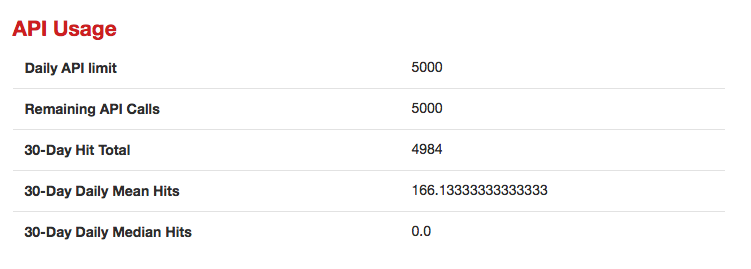

##Loading Library. 

YelpR: An R library for the Yelp Fusion API. For more detail about this library you can go to https://github.com/OmaymaS/yelpr

RSocrate: The Socrata Open Data API allows you to programmatically access a wealth of open data resources from governments, non-profits, and NGOs around the world. For more detail, you can go to https://dev.socrata.com/
```{r, echo=FALSE}
library(yelpr)
library(RSocrata)
library(tidyverse)
```

```{r}
all_df<- read.socrata("https://data.cityofnewyork.us/resource/43nn-pn8j.json")
```

## Understand your data.
Glimpsing the opendata, we decided to use `Phone` as Yelp Fusion API input to acquire business detail. 
```{r}
glimpse(all_df)
```

## Use Phone as API input to acquire business detail. 
There are 384,150 rows of data, with lots of duplicated phone numbers. We need to identify unique phone numbers. 
```{r}
dim(all_df)
rest_phone=data.frame(all_df$camis,all_df$phone)
names(rest_phone) = c('camis','phone')
unique_rest_phone= rest_phone[!duplicated(rest_phone),]
dim(unique_rest_phone)
```
Now, we acquire 27,105 unique phone numbers. 

## Acquire Yelp API Key
In the create new app form, enter information about your app, then agree to Yelp API Terms of Use and Display Requirements. Then click the Submit button. You will now have an API Key.

## Yelp Fusion API daily limit
You will find each API credential can only be called 5000 times a day. To acquire the 27105 business details in one day. You will need at least 6 API credentials. 



## Acquire Business Detail
```{r}
key = 'Your_Yelp_API_Key'
n_lower = 1
n_upper = n_lower+10
phone_df=unique_rest_phone[c(n_lower:n_upper),]
```


##Create empty list to store data.
```{r}
id = c()
rating = c()
review_count= c()
lat= c()
lon= c()
price= c()
phone_ls = c()
camis_ls = c()
```

##Create for loop to acquire Yelp Business data.
I commented out some lines as it took so long time to run. 
```{r}
for(i in 1:nrow(phone_df)) {
    row <- phone_df[i,]
    phone=paste0('+1',row$phone)
    camis=row$camis
    test=business_search_phone(api_key = key, phone_number = phone)
    camis_ls = c(camis_ls,camis)
    phone_ls = c(phone_ls,phone)
    id = c(id,test$businesses$id)
    rating=c(rating,test$businesses$rating)
    review_count = c(review_count,test$businesses$review_count)
    lat=c(lat,test$businesses$coordinates$latitude)
    lon=c(lon,test$businesses$coordinates$longitude)
    price = c(price,test$businesses$price)
}
```

## Combine list to Dataframe and save as .csv in folder
```{r}
# business_detail= data.frame(cbind(camis_ls,phone_ls,id,rating, review_count, lat,lon,price))
# csvname = paste0('./yelp_data/yelp',n_lower,'_',n_upper,'.csv')
##write.csv(business_detail, file = csvname)
```

